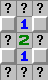
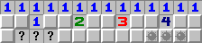

扫雷的判雷方法主要分为：
- 平凡判雷
- 基础定式
- 穷举
- 不等式
- 数雷

上述几种方法中，减法公式、不等式、穷举、数雷属于高阶方法，平凡判雷和基础定式属于低阶方法。有些人即使只会低阶方法也可以冲击小雷帝。对于竞速扫雷，低阶方法是必需的。很多巧克力局部需要用到穷举、数雷，甚至穷举和数雷的结合。GO的战役模式中极少用到穷举，但是数雷很常见。不等式判雷是穷举的一种更易于理解的替代方案，但是无论用手算还是机算，实用性都不如穷举。

竞速扫雷中经常遇到无法判的死猜情况，这是正常的。

后面的摆雷图中，空表示任意数字，雷表示必为雷，按下的问号表示可点开。四周均贴边。

## 平凡判雷
利用扫雷规则，如果某数字n周围已经打开了8-n个非雷格，那么剩下n格必然全是雷。

## 基础定式
基础定式实际上是基于后述高阶技巧总结出来的实战常用形状。基础定式也分为口诀型定式、挖坑定式、减法公式和其他实战常见可解形状。口诀型定式和减法公式仅为初学者快速入门时首先了解的内容。随着对定式理解的深入，渐渐的就可以对实战的形状有更好的理解，知道何种形状可解，何种形状不可解。这些知识是通过大量的实战练习总结出来的，没有一个固定的方法列举。因为竞速扫雷大量局部需要猜，所以很多选手在练习的时候并不会仔细思考一个局部是否可判，往往遇到不熟悉的形状会直接一猜了事。这种策略并不会对纪录成绩有多少影响，所以我们也不会要求一个竞速选手有非常精的判雷技巧。但是从练习初期就注意仔细判雷，形成对局部是否可判的直觉，一定是有利无害的。

口诀型定式和挖坑公式都是减法公式的应用。关于减法公式的理论和应用请参考武帝知乎专栏
- [扫雷新手判雷上路（一）——初步认识减法公式及其衍生的最简单定式](https://zhuanlan.zhihu.com/p/27439584)
- [扫雷进阶玩家判雷核心——减法公式的应用实例（修正版）](https://zhuanlan.zhihu.com/p/28176578)

### 口诀型定式：121、1221、212、2112、111、1111、131、222、112、1112。

关于21定式，请参考武帝知乎专栏[扫雷进阶选手补漏——21定式及其变形的常见应用](https://zhuanlan.zhihu.com/p/27762182)

121及其变形
|121|132|242|
|:-:|:-:|:-:|
||||

1221

下面的定式需要注意数字两端是贴边或是延长一格非雷，而不像上面的定式那样可以悬空。如果认为贴边的1可以视为延长一格非雷的2，那么212、111、112等价，2112、1111、1112等价。
|212|2112|111|1111|112|1112|
|:-:|:-:|:-:|:-:|:-:|:-:|
|||||||

131和222是凸角的情况。
|131|222|
|:-:|:-:|
|||

通过口诀型定式，我们可以解决绝大部分连续直线12数字的情况。对于少数处理不掉的连续12，可以用挖坑定式。挖坑定式可以提高开率，但是不能提高成绩。

### 挖坑定式

我们已经提到了，有些连续12数字是不可解的，但是只要有减法公式可用，就可以尝试挖坑。下图中可以判出左边第三个1下方不是雷，中间的2下方是雷。点开不是雷的那一格开挖。

点开后有四种情况，如下图。若为1，则下方可以继续挖；若为4，则下方被雷封死。2和3不可判，需要借助其他条件。我们这里只讨论挖出1的情况。

点开下方三格后，可以利用上面的信息向下继续判。下面只举几个典型的例子，要理解原理才能在实战中灵活使用。

|开出了1，下方一圈都能点开|开出交错数字，可以用减法公式|开出大数字，下方一圈都是雷|
|:-:|:-:|:-:|
| | | |

如果需要使用减法公式，有时可以直接使用口诀公式，有时需要继续挖坑。挖坑每一步都有变数，随时可能打开局面，也随时可能走入死胡同。挖坑过后会留下孤立bv（人造is），导致后续处理慢，所以过度挖坑会影响成绩。

上面举的例子是没有侧面和对面的信息的。实战中，尤其是侧面的信息，会极大地帮助打开局面。请参考雷网帖子[拐角判雷方法](http://saolei.wang/BBS/Title.asp?Id=14160)

## 穷举
通过对前沿区的雷型暴力穷举，可以知道某些格一定是雷和某些格一定不是雷。

## 不等式
在解释不等式判雷的时候，我们认为每个未知格是一个变量，1为雷，0为非雷。通过局面中的信息可以推出一些不等式，并最终使用下面方法得到等式的结果：
1. 若a<=b且b<=a，则a=b
2. 若a<=b且a+b<=1，则a=0；若a<=b且a+b>=1，则b=1

常用的不等式生成方法：
1. 若a=b+c，则a>=b
2. 若a+b=c+d+1，则a>=c。这一条可以拓展到更多变量的情况，例如若a+b+c=d+e+f+g+2，则a>=d
3. 若a+b<=c+b，则a<=c。逆命题也成立。

这里举几个典型例子介绍一下上面的方法。在雷图中，用行列坐标表示格子的位置。行标从上到下依次为A-Z，列标从左到右依次为a-z。行标列标连起来就是格子的坐标，例如Bc表示第二行第三列。

### 若a<=b且b<=a，则a=b。
这个方法一般适用于环结构，绕环一圈可以得到一串不等式，最终得到a<=b<=a。

由Bc1和Bd1可以知道Ab=Ae+Be+Ce，所以Ab>=Be（第1条生成方法）。同理Be>=Ed，Ed>=Da，Da>=Ab。所以Ab=Be=Ed=Da。代回到Ab=Ae+Be+Ce得Ae=Ce=0，同理前沿区的四角和四边中点都不是雷。

## 死猜
死猜分为对称猜和概率猜。对称猜中，猜各个地方开率相同，随便点一个即可。概率猜中，应该点开率最高的那些格。竞速扫雷实战中一些非常小的局部可以应用概率猜。运算量大的概率猜属于扫雷算法的研究内容。
